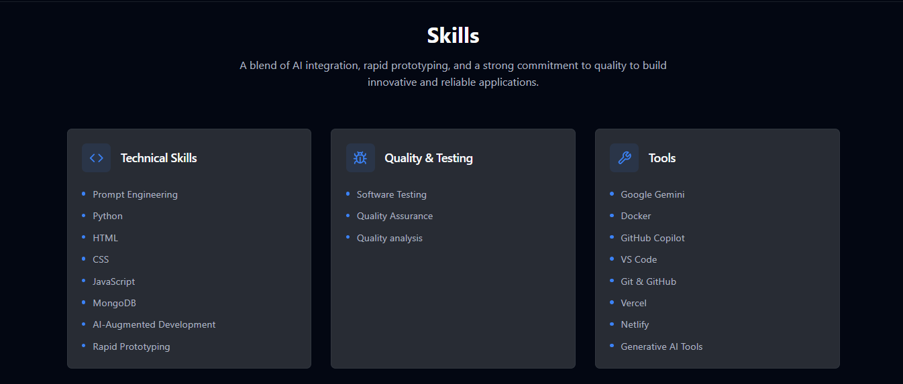
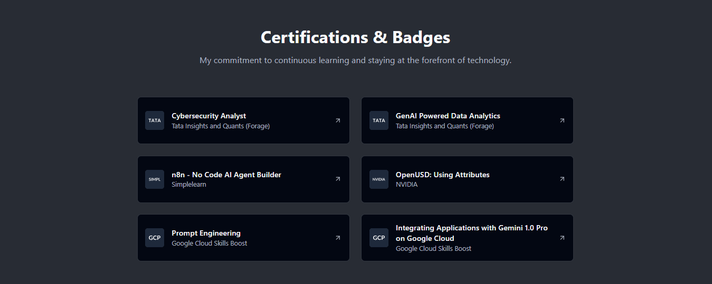

<!-- PROJECT SHIELDS -->
[](#license)
[](https://vercel.com)
[](https://react.dev/)
[](https://vitejs.dev/)
[](https://tailwindcss.com/)
[](https://www.typescriptlang.org/)

---

# 🌐 Neev Lila — Developer Portfolio

Welcome to my **personal developer portfolio**.  
This website showcases my **work, technical skills, tools, certifications, and contact information** with a modern, responsive design.

🔗 **Live site:** [neevlila.vercel.app](https://neevlila.vercel.app)

---

## 📘 Table of Contents

1. [About](#about)
2. [Features](#features)
3. [Tech Stack](#tech-stack)
4. [Screenshots](#screenshots)
5. [Getting Started](#getting-started)
6. [Project Structure](#project-structure)
7. [Customization](#customization)
8. [Deployment](#deployment)
9. [Contributing](#contributing)
10. [License](#license)

---

## 🧐 About

This portfolio is built with **React, TypeScript, Vite, and TailwindCSS**, using **shadcn/ui** and **Radix UI** components for a sleek and accessible design.  

The goal is to highlight:  
- 🚀 Technical skills and toolset  
- 💼 Projects & case studies  
- 🎓 Certifications  
- 📬 Professional bio & contact info  

Designed for **clarity, performance, and interactivity** — with smooth animations, hover effects, and a consistent theme.

---

## ✨ Features

- ⚡ Blazing fast with **Vite**
- 🎨 Styled with **TailwindCSS** + **shadcn/ui**
- 🌗 Dark mode support
- 📊 Interactive charts (Recharts)
- 🧩 Modular, reusable components
- 🔔 Toast notifications with **sonner**
- 🪄 Command palette (cmdk)
- 🎡 Carousels with **Embla**
- 🔐 Type-safe forms (React Hook Form + Zod)
- 🔎 Data fetching & caching (TanStack Query)
- 📱 Fully responsive & mobile-friendly
- 🌍 Deployed on **Vercel**

---

## 🛠 Tech Stack

| Category            | Tools / Libraries |
|---------------------|------------------|
| **Framework**       | React 18 + TypeScript + Vite 7 |
| **UI/Styling**      | TailwindCSS 3, shadcn/ui, Radix UI, tailwind-merge |
| **Icons**           | lucide-react |
| **State/Data**      | @tanstack/react-query, react-router-dom |
| **Forms/Validation**| React Hook Form, Zod, @hookform/resolvers |
| **Charts**          | Recharts |
| **3D/Graphics**     | Three.js, react-three-fiber |
| **UI Enhancements** | Embla Carousel, Sonner (toasts), Vaul (drawers), cmdk |
| **Deployment**      | Vercel |
| **Lint/Formatting** | ESLint, TypeScript ESLint |

---

## 📸 Screenshots

| Home | Skills | Projects | Certifications |
|------|--------|----------|----------------|
|  |  |  |  |

> 📌 Update these screenshot paths once added to your repo.

---

## 🚀 Getting Started

### Prerequisites
- Node.js 18+
- npm, yarn, or pnpm

### Installation

```bash
# 1. Clone the repo
git clone https://github.com/neevlila/Neev-Lila-portfolio.git
cd Neev-Lila-portfolio

# 2. Install dependencies
npm install
# or
# yarn install
# pnpm install

# 3. Run in development mode
npm run dev
# or
# yarn dev
# pnpm dev

# 4. Build for production
npm run build
npm start